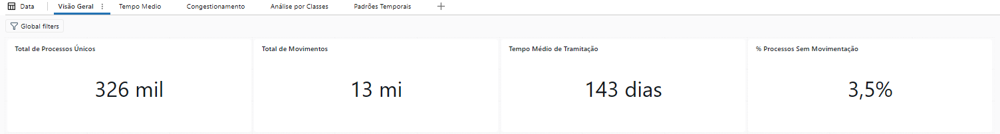
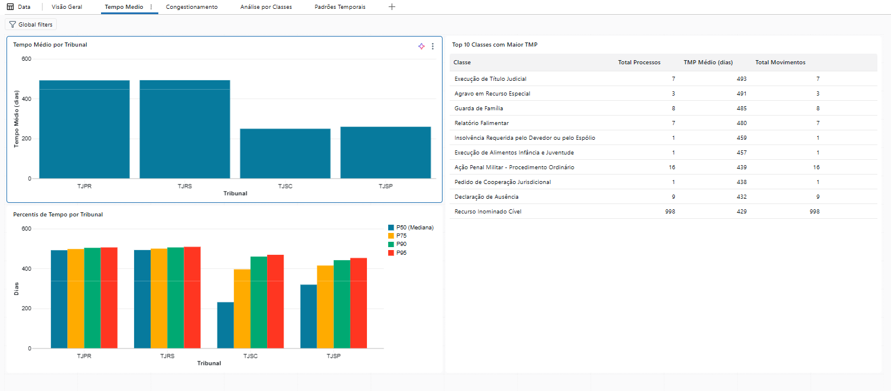
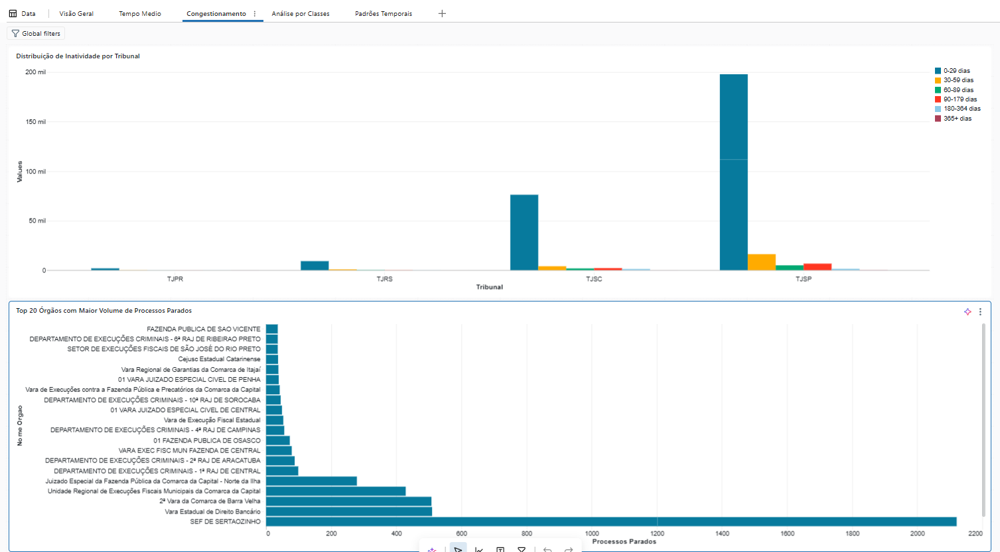
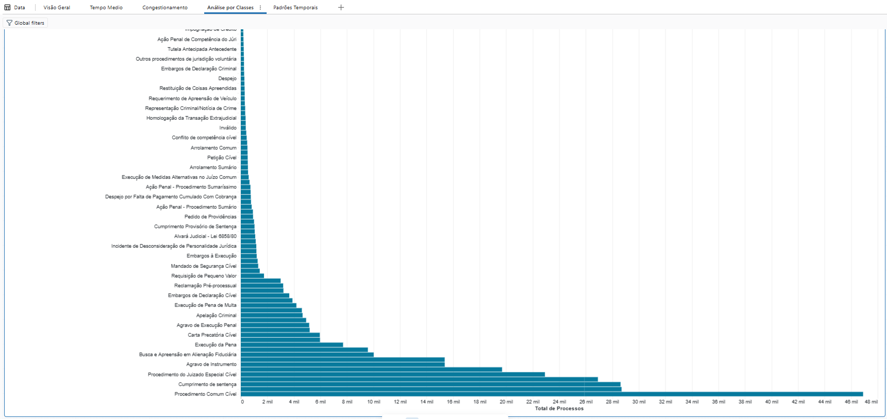
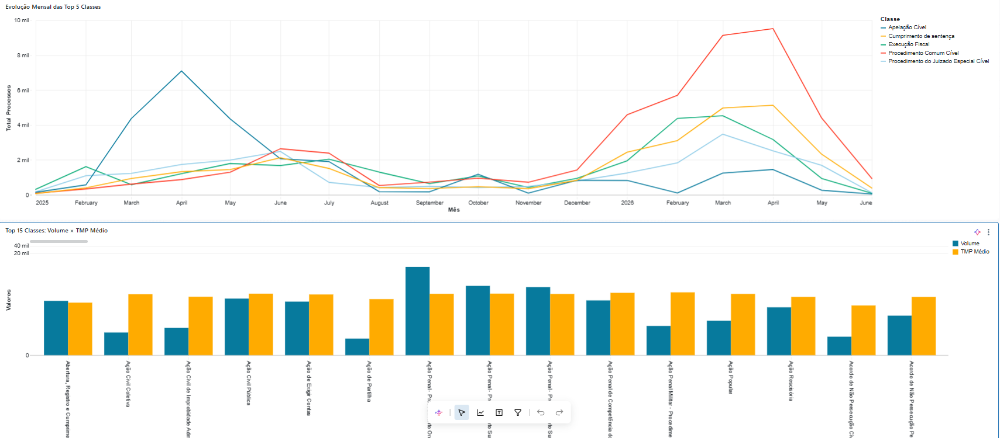
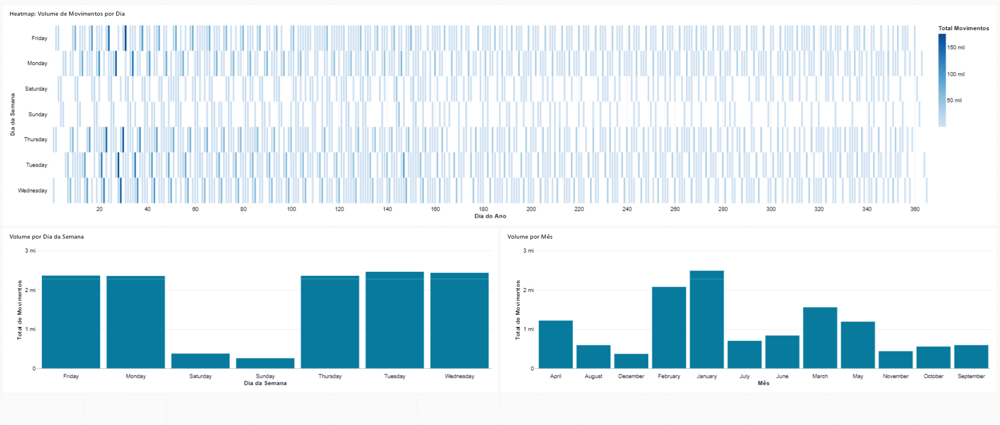

# Dashboard

As queries SQL deste diretório servem de fonte de dados para a construção dos dashboards dentro do Databricks.

Abaixo, uma prévia das páginas construídas a partir delas.

## Visão Geral

KPIs principais: total de processos únicos, total de movimentos, tempo médio de tramitação e % de processos sem movimentação.

## Tempo Médio

Tempo médio de tramitação por tribunal, percentis de tempo (P50/P75/P90/P95) e as Top 10 classes com maior TMP.

## Congestionamento

Processos parados por faixa de tempo e por tribunal, e os Top 20 órgãos com maior volume de processos parados.

## Análise por Classes

Volume de processos por classe, evolução mensal das Top 5 classes e a relação volume × TMP médio.

## Padrões Temporais

Heatmap de movimentos por dia do ano × dia da semana, e o volume de movimentos por dia da semana e por mês.

